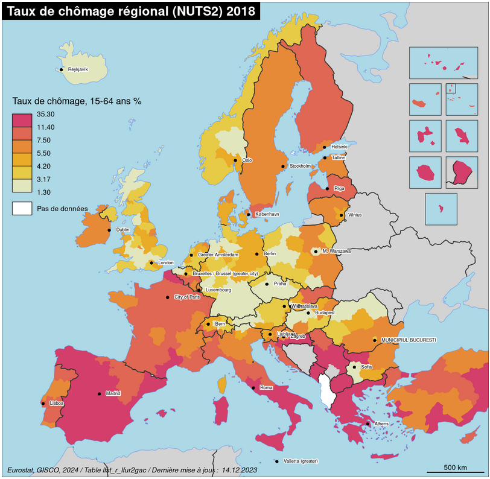

## Un modèle cartographique pour intégrer les territoires périphériques avec R

Ce [notebook](https://rysebaert.github.io/map_template/) présente une solution technique pour créer un modèle cartographique harmonieux pour l'Europe, qui inclut les territoires périphériques europénes (DROM, Canaries, Madère, Açores) dans l'emprise principale du modèle cartographique. Il s'agit ici d'un cas d'usage avancé de la librairie [`mapinsetr`](https://github.com/riatelab/mapinsetr).



### Licence
Attribution-ShareAlike 4.0 International (CC BY-SA 4.0)

This is a human-readable summary of (and not a substitute for) the license. Disclaimer.
You are free to:
* Share — copy and redistribute the material in any medium or format
* Adapt — remix, transform, and build upon the material for any purpose, even commercially.

This license is acceptable for Free Cultural Works. The licensor cannot revoke these freedoms as long as you follow the license term.

### Citation

```
@online{ysebaert2024,
  author = {Ronan Ysebaert},
  title = {Un modèle cartographique pour intégrer les territoires périphériques avec R},
  date = {2024-03},
  publisher = {GitHub},
  journal = {GitHub repository},
  howpublished = {\url{https://github.com/rysebaert/map_template}},
  url = {https://rysebaert.github.io/map_template/},
  langid = {fr}
}
```